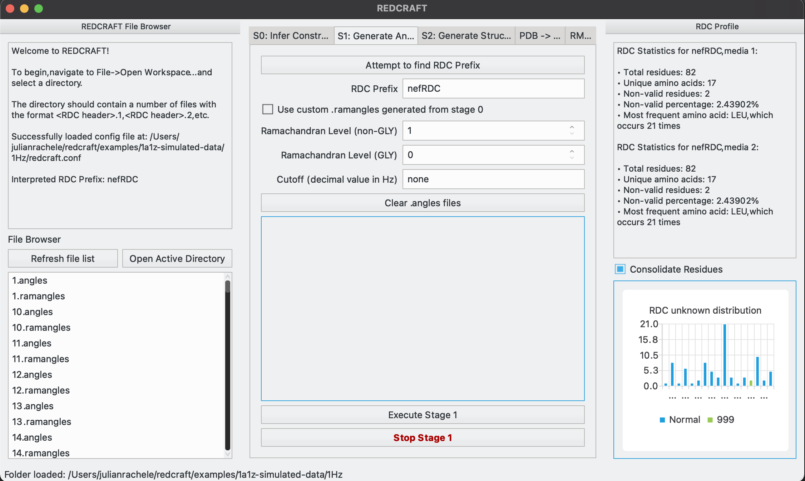
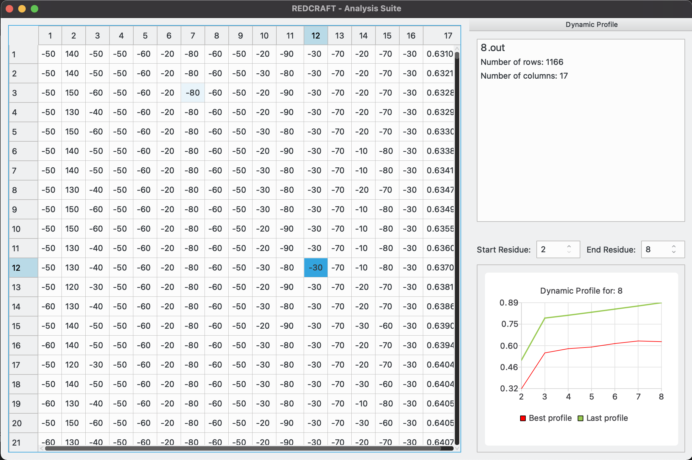
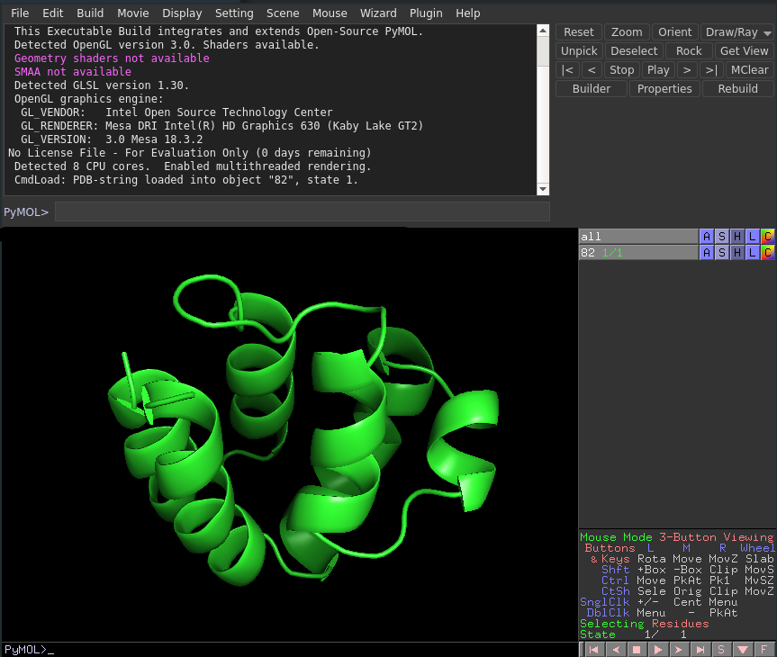
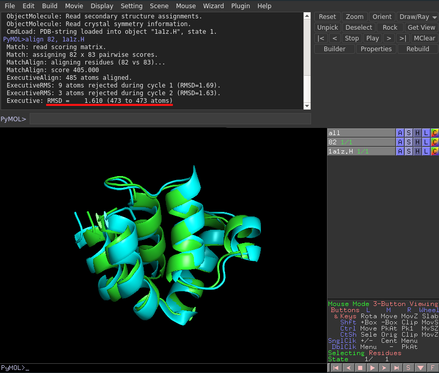

What is REDCRAFT?
=================
REDCRAFT is an open-source software tool for determining a protein's structure using `residual dipolar couplings (RDCs) <https://en.wikipedia.org/wiki/Residual_dipolar_coupling>`_.
It allows simultaneous determination of a protein's structure and dynamics.
Its effectiveness has been demonstrated on both synthetic and experimental data.
REDCRAFT contains stages that allow the incorporation of user-specified dihedral angle constraints,
such as those produced by TALOS or a restriction to specific regions of Ramachandran space.
It is robust with respect to noise and missing data.
The program is highly efficient and can produce a structure for an 80-residue protein within minutes.

GUI exposé
=================

   This is the GUI view for Stage 1.
   The molecule we are working with here is `1a1z <https://www.rcsb.org/structure/1A1Z>`_.
   Stage1 converts RDC data into .angles files.

   REDCRAFT includes many tools for helping researchers make sense of the data they are working with and processing. 
   The analysis suite helps analyze REDCRAFT .out files to view phi/psi angles generated and to see the dynamic profile of each residue.

.. .. figure:: _static/stage2_basic.png
..    :target: _static/stage2_basic.png
..    :scale: 75 %
..    :alt: Stage 2 Basic view

..    These are the basic options for Stage 2.
..    We are mostly leaving everything default, except that the search depth is 1000 instead of the default 100.
   
.. .. figure:: _static/stage2_advanced.png
..    :target: _static/stage2_advanced.png
..    :scale: 75 %
..    :alt: Stage 2 Advanced view

..    These are the advanced options for Stage 2.
..    We are focusing an extra depth of search on problematic residues 16 and 19 in the hopes that the true spatial configuration
..    may be found in those deeper search depths.
..    Additionally, we are enabling refinement, which allows floating point values for generated angles and greater precision in the PDB.

   After generating the intermediate PDBs for residues 1-81, we finally have a complete 82-residue PDB file for 1a1z.
   Using `PyMOL <pymol.org>`_, we can see that the protein looks correct.
   However, we will need to align the protein with the true 1a1z structure and inspect the RMSD to see the fit.

   After placing the true protein (blue) into the scene with the generated molecule (green), we aligned the molecule with ``align 82, 1a1z.H``.
   The RMSD (underlined in red) represents the root mean square deviation between the two proteins, or the overall variability between the two.
   Here we can see that REDCRAFT has generated a molecule within only 1.6A of the true protein, only from phi/psi pairings and the sequence of amino acids!
   
   
